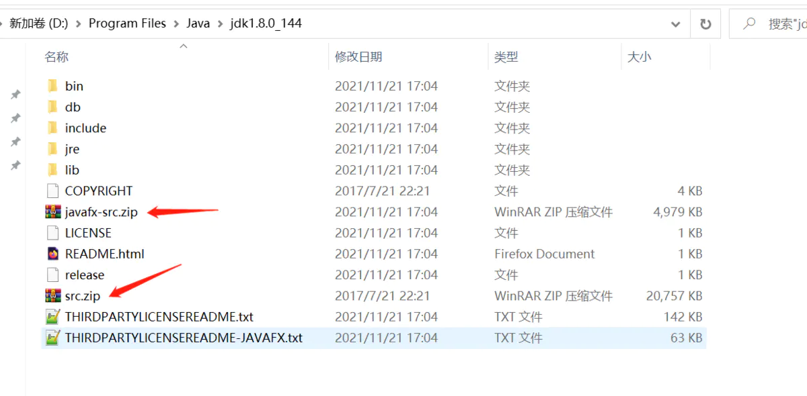
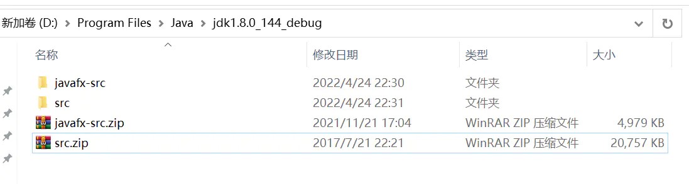
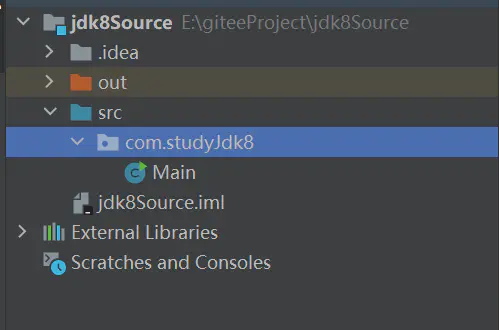
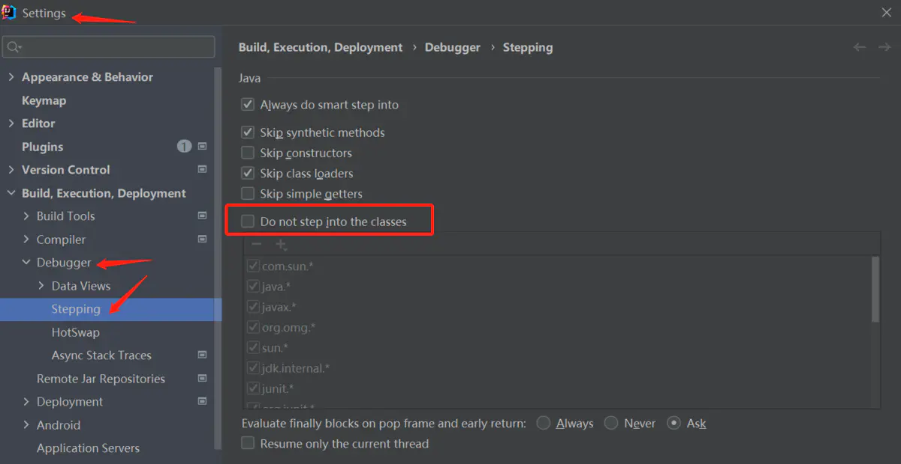
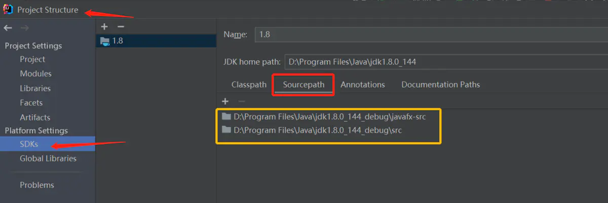

### 调试jdk源码的方法
如果想调试jdk源码，比如HashMap的put方法。F7进入之后，会看到key和value很奇怪，key是D://program Files/java/ 这样的。原因是oracle的rt.jar是锁住的。想调试jdk源码，可以自已编译openjdk源码，也可以简单的设置一下。
下面介绍简单设置的方法：
* 1，首先找到jdk的目录中javafx-src.zip和src.zip这2个压缩文件

* 2，复制到另一文件夹下，并解压

* 3，在IDEA中创建普通的java工程

* 4，设置IDEA的DEBUGGER项：去掉勾选

* 5，设置sourcepath，把原来的2个删掉，换上解压的文件夹javafx-src, src

